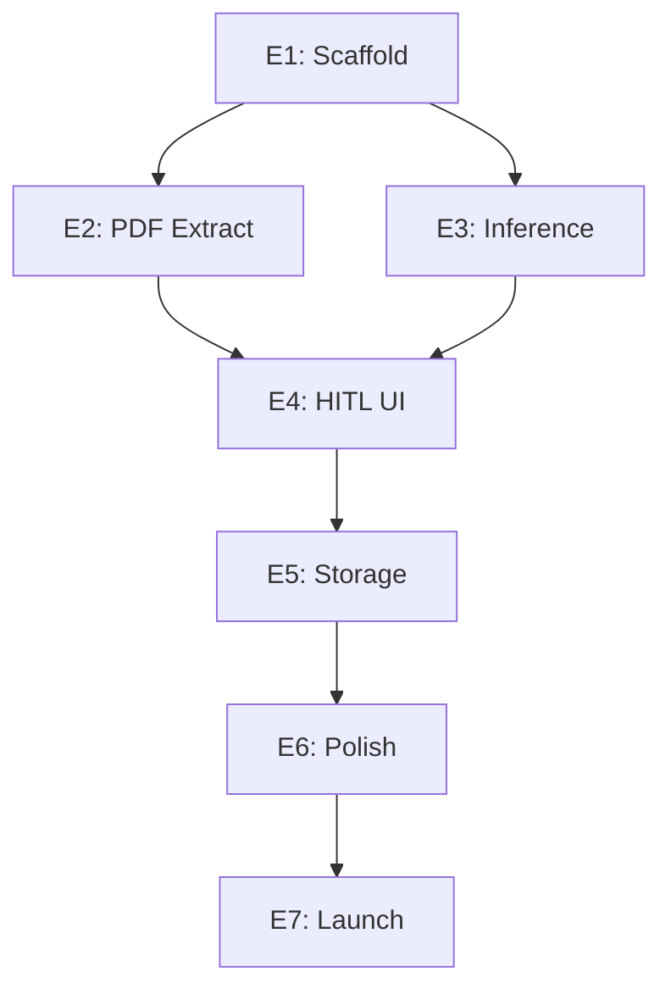

# Generated Task List: Resume Realtime MVP

**Created:** 2025-12-08 CST (America/Chicago)
**Last Updated:** 2025-12-08 CST (America/Chicago)
**Version:** 1.0
**Status:** Active
**PRD Reference:** 014-PP-PROD-resume-realtime-mvp-prd.md
**ADR Reference:** 015-AT-ADEC-resume-realtime-mvp-adr.md

---

## Task Generation Summary

| Metric | Value |
|--------|-------|
| Total Epics | 7 |
| Total Stories | 24 |
| Total Tasks | 89 |
| Estimated Points | 144 |
| Target Duration | 8 weeks |
| Team Size | 1-2 developers |

---

## Work Item Legend

| Icon | Type | SLA |
|------|------|-----|
| 🎭 | Epic | 2-3 weeks |
| 📖 | Story | 3-5 days |
| ☑️ | Task | 1-2 days |
| 🐛 | Bug | 24 hours |
| 🔬 | Spike | 2-3 days |

---

## Epic 1: Extension Scaffold (Week 1)

🎭 **E1: Set up Chrome extension with Leptos + Plasmo**

**Acceptance Criteria:**
- Extension loads in Chrome with popup
- Leptos hydration works in popup context
- Hot reload functional during development
- Manifest V3 compliant

### Stories & Tasks

📖 **S1.1: Initialize extension project** (5 points)

| ID | Task | Estimate | Status |
|----|------|----------|--------|
| ☑️ T1.1.1 | Create Plasmo project scaffold | 2h | ⬜ |
| ☑️ T1.1.2 | Configure Manifest V3 with required permissions | 1h | ⬜ |
| ☑️ T1.1.3 | Set up TypeScript + Leptos integration | 3h | ⬜ |
| ☑️ T1.1.4 | Configure Tailwind CSS for popup styling | 1h | ⬜ |
| ☑️ T1.1.5 | Verify extension loads in Chrome | 30m | ⬜ |

📖 **S1.2: Create popup UI shell** (3 points)

| ID | Task | Estimate | Status |
|----|------|----------|--------|
| ☑️ T1.2.1 | Create popup.html entry point | 1h | ⬜ |
| ☑️ T1.2.2 | Build basic Leptos App component | 2h | ⬜ |
| ☑️ T1.2.3 | Add navigation between parser and settings | 2h | ⬜ |
| ☑️ T1.2.4 | Style with Tailwind (dark theme) | 1h | ⬜ |

📖 **S1.3: Configure build pipeline** (3 points)

| ID | Task | Estimate | Status |
|----|------|----------|--------|
| ☑️ T1.3.1 | Set up cargo-leptos for WASM builds | 2h | ⬜ |
| ☑️ T1.3.2 | Configure wasm-pack integration | 1h | ⬜ |
| ☑️ T1.3.3 | Add dev/prod build scripts to package.json | 1h | ⬜ |
| ☑️ T1.3.4 | Test production build and bundle size | 1h | ⬜ |

**Milestone M1 Deliverable:** Extension loads with empty popup UI

---

## Epic 2: PDF Extraction (Week 2)

🎭 **E2: Implement client-side PDF text extraction**

**Acceptance Criteria:**
- Drag-and-drop PDF upload works
- Text extracted from multi-page PDFs
- Text positions stored for HITL highlighting
- Error handling for invalid files

### Stories & Tasks

📖 **S2.1: Build drag-and-drop upload component** (5 points)

| ID | Task | Estimate | Status |
|----|------|----------|--------|
| ☑️ T2.1.1 | Create DropZone Leptos component | 2h | ⬜ |
| ☑️ T2.1.2 | Implement dragover/drop event handlers | 2h | ⬜ |
| ☑️ T2.1.3 | Add file picker fallback (click to browse) | 1h | ⬜ |
| ☑️ T2.1.4 | Validate MIME type (application/pdf only) | 30m | ⬜ |
| ☑️ T2.1.5 | Validate file size (< 10MB) | 30m | ⬜ |
| ☑️ T2.1.6 | Display upload progress indicator | 1h | ⬜ |
| ☑️ T2.1.7 | Style drop zone with visual feedback | 1h | ⬜ |

📖 **S2.2: Integrate pdf.js for extraction** (8 points)

| ID | Task | Estimate | Status |
|----|------|----------|--------|
| ☑️ T2.2.1 | Add pdf.js dependency | 30m | ⬜ |
| ☑️ T2.2.2 | Create PdfExtractor service module | 2h | ⬜ |
| ☑️ T2.2.3 | Implement getDocument() loading | 1h | ⬜ |
| ☑️ T2.2.4 | Extract text from all pages via getTextContent() | 2h | ⬜ |
| ☑️ T2.2.5 | Store text positions (x, y, width, height) | 2h | ⬜ |
| ☑️ T2.2.6 | Handle multi-column layout detection | 3h | ⬜ |
| ☑️ T2.2.7 | Concatenate pages in reading order | 1h | ⬜ |
| ☑️ T2.2.8 | Error handling (corrupt PDF, password-protected) | 2h | ⬜ |

📖 **S2.3: Create PDF viewer component** (5 points)

| ID | Task | Estimate | Status |
|----|------|----------|--------|
| ☑️ T2.3.1 | Render PDF pages using pdf.js canvas | 3h | ⬜ |
| ☑️ T2.3.2 | Add page navigation (prev/next, page selector) | 2h | ⬜ |
| ☑️ T2.3.3 | Implement zoom controls | 1h | ⬜ |
| ☑️ T2.3.4 | Add text selection layer for HITL | 2h | ⬜ |

🔬 **S2.4: Test PDF extraction accuracy** (3 points)

| ID | Task | Estimate | Status |
|----|------|----------|--------|
| ☑️ T2.4.1 | Create 10-PDF test corpus (diverse layouts) | 2h | ⬜ |
| ☑️ T2.4.2 | Verify text extraction accuracy | 2h | ⬜ |
| ☑️ T2.4.3 | Document edge cases and limitations | 1h | ⬜ |

**Milestone M2 Deliverable:** Text extracted from test PDFs

---

## Epic 3: LLM Inference (Weeks 3-4)

🎭 **E3: Implement local LLM inference with WebGPU**

**Acceptance Criteria:**
- Model downloads with progress indicator
- Inference runs via WebGPU or WASM fallback
- Structured JSON output with confidence scores
- Parse latency < 5s (cached), < 30s (cold)

### Stories & Tasks

📖 **S3.1: Set up transformers.js pipeline** (8 points)

| ID | Task | Estimate | Status |
|----|------|----------|--------|
| ☑️ T3.1.1 | Add transformers.js dependency | 30m | ⬜ |
| ☑️ T3.1.2 | Create InferenceEngine service module | 2h | ⬜ |
| ☑️ T3.1.3 | Implement WebGPU detection and fallback logic | 2h | ⬜ |
| ☑️ T3.1.4 | Configure pipeline for text-generation | 1h | ⬜ |
| ☑️ T3.1.5 | Load Phi-3-mini q4 model | 2h | ⬜ |
| ☑️ T3.1.6 | Test inference on sample text | 1h | ⬜ |

📖 **S3.2: Implement model download and caching** (5 points)

| ID | Task | Estimate | Status |
|----|------|----------|--------|
| ☑️ T3.2.1 | Create ModelManager service | 2h | ⬜ |
| ☑️ T3.2.2 | Implement progressive download with progress events | 3h | ⬜ |
| ☑️ T3.2.3 | Store model in Cache API | 2h | ⬜ |
| ☑️ T3.2.4 | Check cache before download | 1h | ⬜ |
| ☑️ T3.2.5 | Build download progress UI component | 2h | ⬜ |

📖 **S3.3: Create resume extraction prompt** (5 points)

| ID | Task | Estimate | Status |
|----|------|----------|--------|
| ☑️ T3.3.1 | Design prompt template for structured extraction | 2h | ⬜ |
| ☑️ T3.3.2 | Define JSON schema for output | 1h | ⬜ |
| ☑️ T3.3.3 | Implement prompt construction from raw text | 1h | ⬜ |
| ☑️ T3.3.4 | Parse LLM output to TypeScript types | 2h | ⬜ |
| ☑️ T3.3.5 | Handle malformed JSON responses | 2h | ⬜ |

📖 **S3.4: Add confidence scoring** (3 points)

| ID | Task | Estimate | Status |
|----|------|----------|--------|
| ☑️ T3.4.1 | Extract token probabilities from model | 2h | ⬜ |
| ☑️ T3.4.2 | Calculate confidence per field | 2h | ⬜ |
| ☑️ T3.4.3 | Add confidence to output schema | 30m | ⬜ |

🔬 **S3.5: Benchmark and optimize inference** (5 points)

| ID | Task | Estimate | Status |
|----|------|----------|--------|
| ☑️ T3.5.1 | Measure cold start latency | 1h | ⬜ |
| ☑️ T3.5.2 | Measure cached inference latency | 1h | ⬜ |
| ☑️ T3.5.3 | Profile memory usage during inference | 2h | ⬜ |
| ☑️ T3.5.4 | Test WASM fallback performance | 2h | ⬜ |
| ☑️ T3.5.5 | Document performance characteristics | 1h | ⬜ |

**Milestone M3 Deliverable:** Fields extracted with confidence scores

---

## Epic 4: HITL Correction UI (Week 5)

🎭 **E4: Build human-in-the-loop field correction interface**

**Acceptance Criteria:**
- Split-pane view (PDF left, fields right)
- Click field → highlight source in PDF
- Select PDF text → update field
- Add/remove array items (experience, education, skills)

### Stories & Tasks

📖 **S4.1: Create split-pane layout** (3 points)

| ID | Task | Estimate | Status |
|----|------|----------|--------|
| ☑️ T4.1.1 | Build SplitPane component with resizable divider | 2h | ⬜ |
| ☑️ T4.1.2 | Mount PDF viewer in left pane | 1h | ⬜ |
| ☑️ T4.1.3 | Mount field editor in right pane | 1h | ⬜ |
| ☑️ T4.1.4 | Persist pane size in localStorage | 30m | ⬜ |

📖 **S4.2: Build field editor component** (8 points)

| ID | Task | Estimate | Status |
|----|------|----------|--------|
| ☑️ T4.2.1 | Create ParsedResumeForm component | 2h | ⬜ |
| ☑️ T4.2.2 | Build editable text fields (name, email, phone, location) | 2h | ⬜ |
| ☑️ T4.2.3 | Build experience array editor with add/remove | 3h | ⬜ |
| ☑️ T4.2.4 | Build education array editor with add/remove | 2h | ⬜ |
| ☑️ T4.2.5 | Build skills tag editor with add/remove | 2h | ⬜ |
| ☑️ T4.2.6 | Display confidence indicators per field | 1h | ⬜ |
| ☑️ T4.2.7 | Style with color-coded confidence (green/yellow/red) | 1h | ⬜ |

📖 **S4.3: Implement field-to-PDF linking** (5 points)

| ID | Task | Estimate | Status |
|----|------|----------|--------|
| ☑️ T4.3.1 | Store source text positions per field | 2h | ⬜ |
| ☑️ T4.3.2 | On field click, scroll PDF to source | 2h | ⬜ |
| ☑️ T4.3.3 | Highlight source text in PDF | 2h | ⬜ |
| ☑️ T4.3.4 | Clear highlight on field blur | 30m | ⬜ |

📖 **S4.4: Implement PDF-to-field correction** (5 points)

| ID | Task | Estimate | Status |
|----|------|----------|--------|
| ☑️ T4.4.1 | Enable text selection in PDF viewer | 2h | ⬜ |
| ☑️ T4.4.2 | Show "Assign to field" context menu | 2h | ⬜ |
| ☑️ T4.4.3 | Update field value with selected text | 1h | ⬜ |
| ☑️ T4.4.4 | Update source position reference | 1h | ⬜ |

**Milestone M4 Deliverable:** Corrections persist

---

## Epic 5: Encrypted Storage (Week 6)

🎭 **E5: Implement encrypted local storage**

**Acceptance Criteria:**
- Candidate data encrypted with AES-256-GCM
- Key generated on first run
- Data persists across browser sessions
- Export to JSON works

### Stories & Tasks

📖 **S5.1: Set up IndexedDB schema** (3 points)

| ID | Task | Estimate | Status |
|----|------|----------|--------|
| ☑️ T5.1.1 | Create DatabaseService module | 2h | ⬜ |
| ☑️ T5.1.2 | Define candidates store with indexes | 1h | ⬜ |
| ☑️ T5.1.3 | Define settings store | 30m | ⬜ |
| ☑️ T5.1.4 | Implement database versioning/migrations | 1h | ⬜ |

📖 **S5.2: Implement encryption layer** (5 points)

| ID | Task | Estimate | Status |
|----|------|----------|--------|
| ☑️ T5.2.1 | Create CryptoService module | 2h | ⬜ |
| ☑️ T5.2.2 | Generate AES-256 key via SubtleCrypto | 1h | ⬜ |
| ☑️ T5.2.3 | Store key in chrome.storage.session | 1h | ⬜ |
| ☑️ T5.2.4 | Implement encrypt(data) function | 2h | ⬜ |
| ☑️ T5.2.5 | Implement decrypt(blob) function | 2h | ⬜ |
| ☑️ T5.2.6 | Generate unique IV per encryption | 30m | ⬜ |

📖 **S5.3: Implement CRUD operations** (5 points)

| ID | Task | Estimate | Status |
|----|------|----------|--------|
| ☑️ T5.3.1 | Implement saveCandidate(resume) | 2h | ⬜ |
| ☑️ T5.3.2 | Implement getCandidate(universalId) | 1h | ⬜ |
| ☑️ T5.3.3 | Implement listCandidates() | 1h | ⬜ |
| ☑️ T5.3.4 | Implement deleteCandidate(universalId) | 1h | ⬜ |
| ☑️ T5.3.5 | Implement Universal ID hashing (SHA-256) | 1h | ⬜ |

📖 **S5.4: Implement export functionality** (3 points)

| ID | Task | Estimate | Status |
|----|------|----------|--------|
| ☑️ T5.4.1 | Add "Export JSON" button | 30m | ⬜ |
| ☑️ T5.4.2 | Serialize resume to JSON | 30m | ⬜ |
| ☑️ T5.4.3 | Trigger browser download | 1h | ⬜ |
| ☑️ T5.4.4 | Add "Copy to Clipboard" option | 30m | ⬜ |

**Milestone M5 Deliverable:** Encrypted save/load works

---

## Epic 6: Polish & Performance (Week 7)

🎭 **E6: Optimize performance and UX polish**

**Acceptance Criteria:**
- Parse latency P95 < 5s (cached)
- Memory usage < 4GB peak
- Keyboard navigation works
- Error states handled gracefully

### Stories & Tasks

📖 **S6.1: Performance optimization** (5 points)

| ID | Task | Estimate | Status |
|----|------|----------|--------|
| ☑️ T6.1.1 | Profile and optimize inference pipeline | 3h | ⬜ |
| ☑️ T6.1.2 | Optimize PDF rendering (lazy page loading) | 2h | ⬜ |
| ☑️ T6.1.3 | Reduce WASM bundle size | 2h | ⬜ |
| ☑️ T6.1.4 | Add loading states throughout UI | 1h | ⬜ |

📖 **S6.2: Error handling polish** (3 points)

| ID | Task | Estimate | Status |
|----|------|----------|--------|
| ☑️ T6.2.1 | Create ErrorBoundary component | 1h | ⬜ |
| ☑️ T6.2.2 | Add user-friendly error messages | 1h | ⬜ |
| ☑️ T6.2.3 | Implement retry logic for transient failures | 2h | ⬜ |
| ☑️ T6.2.4 | Add "Report Issue" link | 30m | ⬜ |

📖 **S6.3: Accessibility improvements** (3 points)

| ID | Task | Estimate | Status |
|----|------|----------|--------|
| ☑️ T6.3.1 | Add keyboard navigation (Tab, Enter, Escape) | 2h | ⬜ |
| ☑️ T6.3.2 | Add ARIA labels to interactive elements | 1h | ⬜ |
| ☑️ T6.3.3 | Test with screen reader (VoiceOver) | 1h | ⬜ |
| ☑️ T6.3.4 | Verify color contrast ratios | 30m | ⬜ |

📖 **S6.4: Settings page** (3 points)

| ID | Task | Estimate | Status |
|----|------|----------|--------|
| ☑️ T6.4.1 | Create Settings component | 1h | ⬜ |
| ☑️ T6.4.2 | Add model selection (Phi-3 vs Llama-3.2) | 1h | ⬜ |
| ☑️ T6.4.3 | Add "Clear cached model" button | 1h | ⬜ |
| ☑️ T6.4.4 | Add "Clear all data" button with confirmation | 1h | ⬜ |

**Milestone M6 Deliverable:** Performance targets met

---

## Epic 7: Launch Preparation (Week 8)

🎭 **E7: Prepare for Chrome Web Store launch**

**Acceptance Criteria:**
- Chrome Web Store listing approved
- Privacy policy published
- 100-resume test set passes
- Zero critical bugs

### Stories & Tasks

📖 **S7.1: Chrome Web Store assets** (3 points)

| ID | Task | Estimate | Status |
|----|------|----------|--------|
| ☑️ T7.1.1 | Create extension icons (16, 32, 48, 128px) | 2h | ⬜ |
| ☑️ T7.1.2 | Create promotional screenshots (1280x800) | 2h | ⬜ |
| ☑️ T7.1.3 | Write store listing description | 1h | ⬜ |
| ☑️ T7.1.4 | Create promotional tile (440x280) | 1h | ⬜ |

📖 **S7.2: Legal documents** (2 points)

| ID | Task | Estimate | Status |
|----|------|----------|--------|
| ☑️ T7.2.1 | Draft privacy policy | 2h | ⬜ |
| ☑️ T7.2.2 | Publish privacy policy (GitHub Pages) | 1h | ⬜ |
| ☑️ T7.2.3 | Add privacy policy link to extension | 30m | ⬜ |

📖 **S7.3: Final testing** (5 points)

| ID | Task | Estimate | Status |
|----|------|----------|--------|
| ☑️ T7.3.1 | Run 100-resume accuracy test | 4h | ⬜ |
| ☑️ T7.3.2 | Document accuracy results | 1h | ⬜ |
| ☑️ T7.3.3 | Verify no external network calls | 1h | ⬜ |
| ☑️ T7.3.4 | Test on Chrome, Edge, Firefox | 2h | ⬜ |
| ☑️ T7.3.5 | Fix critical bugs | Variable | ⬜ |

📖 **S7.4: Store submission** (2 points)

| ID | Task | Estimate | Status |
|----|------|----------|--------|
| ☑️ T7.4.1 | Build production package | 1h | ⬜ |
| ☑️ T7.4.2 | Submit to Chrome Web Store | 1h | ⬜ |
| ☑️ T7.4.3 | Respond to review feedback | Variable | ⬜ |
| ☑️ T7.4.4 | Tag release in git | 30m | ⬜ |

**Milestone M7 Deliverable:** Chrome Web Store approved

---

## Sprint Planning Summary

| Sprint | Week | Focus | Points | Key Deliverable |
|--------|------|-------|--------|-----------------|
| Sprint 1 | 1 | E1: Scaffold | 11 | Extension loads |
| Sprint 2 | 2 | E2: PDF Extraction | 21 | Text extracted |
| Sprint 3 | 3 | E3: Inference (part 1) | 18 | Model downloads |
| Sprint 4 | 4 | E3: Inference (part 2) | 13 | Fields extracted |
| Sprint 5 | 5 | E4: HITL UI | 21 | Corrections work |
| Sprint 6 | 6 | E5: Storage | 16 | Data persists |
| Sprint 7 | 7 | E6: Polish | 14 | Performance met |
| Sprint 8 | 8 | E7: Launch | 12 | Store approved |

**Total: 144 points across 8 sprints (18 pts/sprint average)**

---

## Definition of Done

A task is complete when:

- [ ] Code written and compiles without errors
- [ ] Unit tests pass (where applicable)
- [ ] Manual testing performed
- [ ] Code reviewed (self-review for solo dev)
- [ ] No console errors or warnings
- [ ] Accessible via keyboard
- [ ] Works in Chrome latest

---

## Risk Tracking

| Risk | Mitigation | Status |
|------|------------|--------|
| WebGPU unavailable | WASM fallback implemented in S3.1 | ⬜ |
| Model accuracy < 90% | HITL corrections in E4 | ⬜ |
| Store rejection | Policy review in S7.3 | ⬜ |
| Bundle too large | Optimization in S6.1 | ⬜ |

---

## Dependencies

---

---
intent solutions io
Contact: jeremy@intentsolutions.io

---
**Created:** 2025-12-08 CST (America/Chicago)
